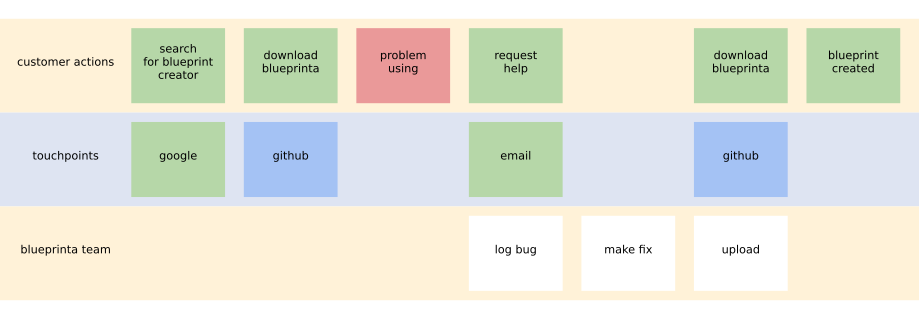

# blueprinta

service blueprint creator

## description

`blueprinta` is a command line tool for generating [service blueprint](https://en.wikipedia.org/wiki/Service_blueprint) diagrams
from easily editable definitions.

## history

it was directly inspired by https://medium.com/capitalonedesign/easier-better-faster-stronger-9f36739cfd0c.

## current status

`blueprinta` is implemented as a python command line tool that takes a spreadsheet of cards in lanes
represented as cells in columns, stored in excel format.

the excel files used as sources have so far only been tested as downloads from Google Sheets in excel format.

## an example

generated from example source sheet `examples/blueprinta.xlsx`:

## pre-requisites

a working python 3 environment or docker.

clone this repo and cd to its folder.

## how to run

on docker:

`./blueprinta whatever.xlsx whatever.svg`

to run included example on docker:

`./create-example.sh`

on python 3 (e.g. in venv)

`python create-blueprint.py whatever.xlsx whatever.svg`

## features

currently:
- cards in lanes
- colours of cards and lanes taken from cells or lane headings

envisaged:
 - some technical cleanup
 - spike links and arrows

## development

TDD'ed the first basics, then rushed out needed features for immediate need.

currently going back to fix that debt:
- cover current functionality with tests
- make Lane and Card classes responsible for their own rendering

